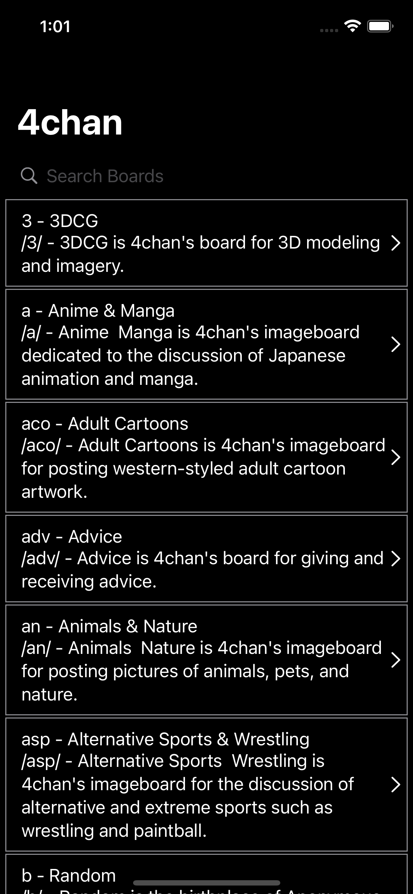
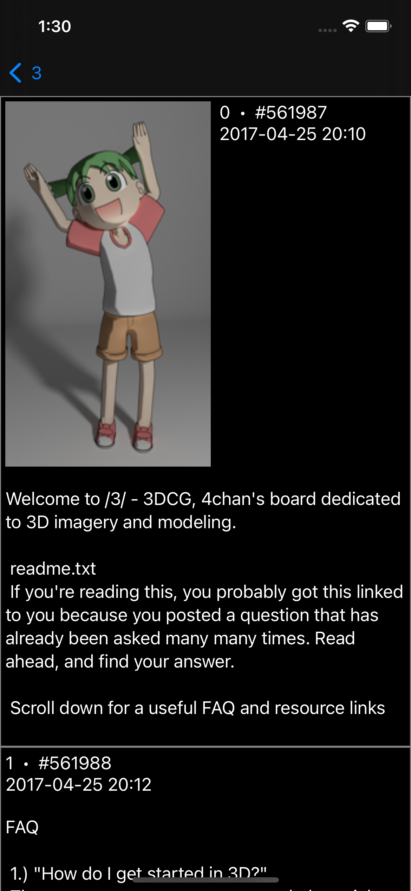

<!-- PROJECT SHIELDS -->
<!--
*** I'm using markdown "reference style" links for readability.
*** Reference links are enclosed in brackets [ ] instead of parentheses ( ).
*** See the bottom of this document for the declaration of the reference variables
*** for contributors-url, forks-url, etc. This is an optional, concise syntax you may use.
*** https://www.markdownguide.org/basic-syntax/#reference-style-links
-->
[![Contributors][contributors-shield]][contributors-url]
[![Forks][forks-shield]][forks-url]
[![Stargazers][stars-shield]][stars-url]
[![Issues][issues-shield]][issues-url]
[![GPL3 License][license-shield]][license-url]

[](https://github.com/vaniteis/swiftchan/tags/)


<!-- PROJECT LOGO -->
<br />
<p align="center">
  <a href="https://github.com/vanities/swiftchan">
    
  </a>

  <h3 align="center">swiftchan</h3>

  <p align="center">
    open source 4chan ios app written in swiftUI.
    <br />
  </p>
</p>


<!-- TABLE OF CONTENTS -->
## Table of Contents

* [About the Project](#about-the-project)
  * [Built With](#built-with)
* [Getting Started](#getting-started)
  * [Prerequisites](#prerequisites)
  * [Installation](#installation)
* [Usage](#usage)
* [Roadmap](#roadmap)
* [Contributing](#contributing)
* [License](#license)
* [Contact](#contact)
* [Acknowledgements](#acknowledgements)


<!-- ABOUT THE PROJECT -->
## About The Project

  


Why aren't there many open source apps? idk. Heavily inspired by TheChan. Plays webms and gifs natively in app.

Here's why:
* ios is ok, why did you switch from android?
* you don't want to download a shady app from 3rd party appstores and you're not jailbroken
* apple bans the app from the app store, but leaves reddit where you can search for people killing themselves :smile:


### Built With
Dev requirements used in the app with CocoaPods and Swift Package Manager.

* [URLImage](https://github.com/dmytro-anokhin/url-image)
* [Alamofire](https://github.com/Alamofire/Alamofire)
* [SwiftSoup](https://github.com/scinfu/SwiftSoup)
* [SwiftyGif](https://github.com/kirualex/SwiftyGif)
* [MobileVLCKit](https://code.videolan.org/videolan/VLCKit)


<!-- GETTING STARTED -->
## Getting Started

To get a local copy up and running follow these simple steps.

### Prerequisites

Download [xCode](https://apps.apple.com/us/app/xcode/id497799835?mt=12)

Install [CocoaPods](https://guides.cocoapods.org/using/getting-started.html)

### Installation

1. Clone the repo
```sh
git clone https://github.com/vanities/swiftchan
```
2. Install pod pakages
```sh
pod install
```
3. That's it! Open the workspacefile in Xcode.


<!-- USAGE EXAMPLES -->
## Usage

Open the `swiftchan.xcworkspace` file with Xcode.


<!-- ROADMAP -->
## Roadmap

See the [open issues](https://github.com/vanities/swiftchan/issues) for a list of proposed features (and known issues).


<!-- CONTRIBUTING -->
## Contributing

Contributions are what make the open source community such an amazing place to be learn, inspire, and create. Any contributions you make are **greatly appreciated**.

1. Fork the Project
2. Create your Feature Branch (`git checkout -b feature/AmazingFeature`)
3. Commit your Changes (`git commit -m 'Add some AmazingFeature'`)
4. Push to the Branch (`git push origin feature/AmazingFeature`)
5. Open a Pull Request


<!-- LICENSE -->
## License

Distributed under the GPL3 License. See `LICENSE` for more information.


<!-- CONTACT -->
## Contact

Maintainer - [@vanities](https://twitter.com/vanities)

Project Link: [https://github.com/vanities/swiftchan](https://github.com/vanities/swiftchan)


<!-- ACKNOWLEDGEMENTS -->
## Acknowledgements
* [SwiftUI VideoPlayer](https://github.com/wxxsw/VideoPlayer)
* [SwiftUI AVPlayer](https://github.com/ChrisMash/AVPlayer-SwiftUI/blob/master/AVPlayer-SwiftUI/VideoView.swift)
* [Swift 4chan app](https://github.com/jackpal/KleeneStar)


<!-- MARKDOWN LINKS & IMAGES -->
<!-- https://www.markdownguide.org/basic-syntax/#reference-style-links -->
[contributors-shield]: https://img.shields.io/github/contributors/vanities/swiftchan.svg?style=flat-square
[contributors-url]: https://github.com/vanities/swiftchan/graphs/contributors
[forks-shield]: https://img.shields.io/github/forks/vanities/swiftchan.svg?style=flat-square
[forks-url]: https://github.com/vanities/swiftchan/network/members
[stars-shield]: https://img.shields.io/github/stars/vanities/swiftchan.svg?style=flat-square
[stars-url]: https://github.com/vanities/swiftchan/stargazers
[issues-shield]: https://img.shields.io/github/issues/vanities/swiftchan.svg?style=flat-square
[issues-url]: https://github.com/vanities/swiftchan/issues
[license-shield]: https://img.shields.io/github/license/vanities/swiftchan.svg?style=flat-square
[license-url]: https://github.com/vanities/swiftchanblob/master/LICENSE.txt
